#Test Points and diagnostics for Land Rover 3.9 ECU

Original from http://www.landroverclub.net/Club/HTML/ECU_check.htm

ECU's on Fuel Injected Engines
==============================

at the example of the 3.9 Range Rover engine

*Sorry for the sometimes not absolute correct names, text translated from
french*

This procedure should be similar on any engines using an flap for
measuring the air flow. Those who use Lucas ECU box and an Hot Wire to
monitor air flow are slightly different. We used this procedure
successfully on many different cars. But it's at your risc. And you may
well damage a component beyond repair if you screw it up.

---

Connectors and Sensors
----------------------

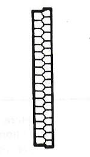Connector to the ECU

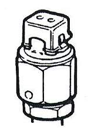Timed thermal contact

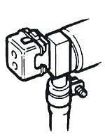Cold start enrichment

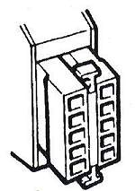Resistance box

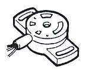Flap position sensor

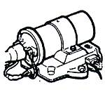 Constant energy coil

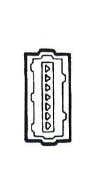 Air flow sensor connector

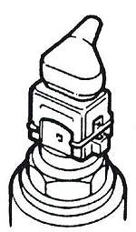 Coolant temperature sensor

 P= pump relay M=main relay S=steering relay

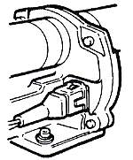 Air mixture valve

---

Feeding of the electronic regulator
-----------------------------------

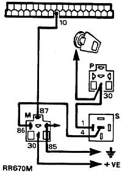

**(This is the ECU box)**

* Connect Voltmetre between Pin 10 and ground. Contact.
* No reading: Check cables and connectors, check Main relay by substitution of a new unit (this is genuine LR instructions...)
* Lower than `11 V`: Check cables and connectors for a bad or corroded contact

**Normal result:** 11-12.5 Volts

---

Fuel pump contacts
------------------


* Connect Voltmetre between Pin 20 and ground. Contact. Air flap closed
* When closed: Something else than =V when flap closed: check switch on air meter (flap) housing
* When moving: No reading: Check wire harness from relay to air metre,
then from air metre to relay of fuel pump. Check the relay by
substitution of a new one. Check the pump by connecting a wire directly
from battery + and - to the pump

**Normal result:** 0 V when closed, 11-12.5V when flap moving

---

Starter rotation signals
------------------------

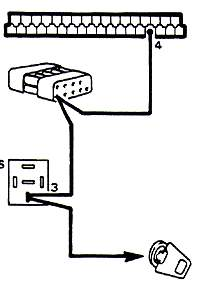

* Connect Voltmetre between Pin 4 and ground. Turn the engine over with
the starter.
* No reading but starter turns: Check wiring harness from ECU to relay
and electronic regulator
* No reading and starter does not turn: check starter and starter relay.
* Reading under `8V`: check batterie (connect another one) and starter

**Normal result:** 8-12V

---

Air metering valve
------------------
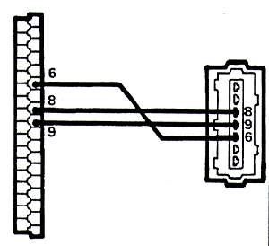


* Connect Ohmmetre:

    between Pin 6 and 8: 360 ohms
    between Pin 6 and 9: 560 ohms
    between Pin 8 and 9: 200 ohms

* Differing values: check cables with ohmmetre, check air metering valve but make sure it's completely closed.

**Normal result:** above values + 10 ohms

---
Water temperature sensor
------------------------
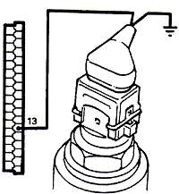

* Connect Ohmmetre between Pin 13and ground
* Differing values: Check cables and connector, change sensor if readings
still differ
* **Take only short readings as sensor may be damaged by heat from curent from ohmmetre**

**Normal result:**

```
-10°C = 7-11,6 kohms

+20°C = 2,1 to 2,9 kohms

+80°C = 0,27 to 0,39 kohms
```
---
RPM signal
----------
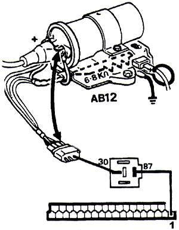

* (constant energy ignition)
* Make a connestion between - of the coil and Pin 1. Connect voltmetre between Pin 1 and ground
* No reading: check the connectors between coil and regulator

**Normal result:**`Fluctuates between 6 and 9V`


---
Injectors
-------------
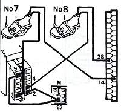

**Injector 7**

* Connect ohmmetre between Pin 14 and 87 of main relay
* Reading below normal: Disconnect one after another the injectors until you find the one with low or 0 resistance. Replace.
* If all are OK you must check the wiring harness and connectors as well as the resistance bloc

**Injector 8**  Connect ohmmetre between Pin 28and 87 of main relay

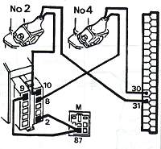

**Injector 2**  Connect ohmmetre between Pin 31 and 87 of main relay

**Injector 4**  Connect ohmmetre between Pin 30and 87 of main relay


**Injector 3**  Connect ohmmetre between Pin 33 and 87 of main relay

**Injector 5**  Connect ohmmetre between Pin 32 and 87 of main relay

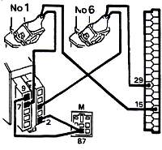

Injector 1  Connect ohmmetre between Pin 15 and 87 of main relay

Injector 6  Connect ohmmetre between Pin 29 and 87 of main relay

**Normal result:** `Between 7 and 10 ohms`

---
Injection ramp
--------------
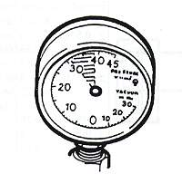

* Mount the manometre on the flexible line to the cold start enrichment
injector. Contact and move the air flap to close the electric circuit of
the fuel pump
* Pression 0: Check if fuel pump gets 12V, if not so replace the relay of
the pump and then the main relay.
* If the pump gets 12 V check it's ground (a common fault) by laying a
wire directly to the ground. If it still does nothing chances are good
the pump is shot. Take it out and check it again on the bench.
* Pression out of limits (above or below): Check for leaks on the complete
circuit, coloring around line connections and leaking injectors, then
pressure regulator and anti-return valve- in this order.

**Normal result:** `2,4 to 2,6 kg/cm2`

---
Air Mixture Thermovalve
-----------------------

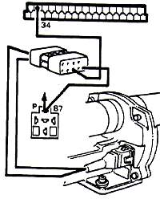

* Possible fault:
* Connect ohmmetre between Pin 34 and 87 of the fuel pump relay
* No reading: Check wiring and connectors between fuel pump relay and air
mix valve as well as electronic regulator. Than disconnect valve and
check it by ohmmetre

**Normal result:** `30 - 40 ohms`

---
Cold Start enrichment injector
------------------------------
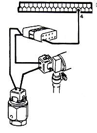

* Possible fault:
* 
  1. Disconnect timed termocontact. 
  2. Successively ground the wires. 
  3. Connect ohmmetre between Pin 4 and ground
* No reading: Check wiring and connectors between ECU, cold start injector and temporised thermocontact.
* Cut off: Check wires, connectors and cold start injector

**Normal result:** `0 - 5,0 ohms`

---
Air temperature sensor
----------------------
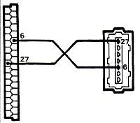

* Possible fault:
* Incorporated in the air flow sensor
* Connect ohmmetre between Pins 6 and 27
* **Take only short readings as sensor may be damaged by heat from curent
from ohmmetre**
* If Reading unlimited: 
  1. disconnect flow meter, 
  2. connect Pins 6 and 27. 
  3. If reading is now 0 the sensor is faulty. 
  4. If reading still unlimited check wiring and connectors as well as ECU connector

**Normal result:**

```
-10°C: 8,26 to 10,56 kohms

+20°C: 2,28 to 2,72 kohms

+50°C: 0,76 to 0,91 kohms
```

---
Air flap position sensor
------------------------
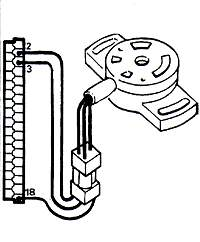

* Possible fault:
* 
  1. Set multimetre on TENSION, reconnect ECU, contact
  2. Measure tension between green (-) and yellow (+) by the back side of the connector block near the ECU. Values should be: `4,3 (+- 0,2V)`. Lower or 0: check wiring and connectors
* Measure tension between green (-) and red (+) by the back side of the
connector block near the ECU. Values should be: `0,325v (+0,35v)`. Loosen screws and rotate sensor until reading is correct
* The tension must grow progressively in the same manner as you open the
air flap. `Progressive from 0,3 to 4,5V`
* If the reading jumps or fluctuates you must change the sensor.

---
Deceleration shut off relay
---------------------------
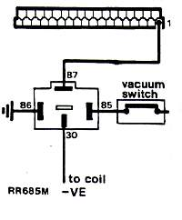

* Possible fault:
* 
  1. Disconnect the wire from coil to relay. 
  2. Contact off. 
  3. Connect ohmmetre between Pins 1 and 30 of the relay. Unlimited is correct. Anything else: Check wires and connectors, then replace relay by a new one.
* Contact. The resistance must drop to 0. Anything else: Check wires and connectors, maybe even the vacuum switch.
* Repeat the measurement at least once.

---
Air flow sensor
---------------
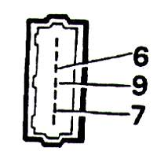

* Possible fault:
* 
  1. Reconnect ECU. 
  2. Contact. 
  3. Pull back the rubber sleeve on the connector.
  4. Connect voltmetre between Pin 6 (+) and Pin 9 (-) `1,55V (+- 9,1V)` This figures from the genuine book but I strongly
suspect a fault here. I think it should read `+-0,1V`
* Connect voltmetre between Pin 9(-) and Pin 7(+) `3,7V +-0,1V`
* Open the flap slowly: The tension must drop `1,6V +-0,2V`
* Abnormal results: Change the sensor

---
Air flow sensor
---------------
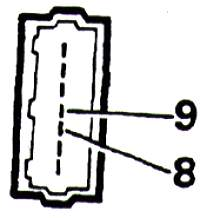

* Possible fault:
* 
  1. Disconnect ECU. 
  2. Contact. 
  3. Pull back the rubber sleeve on the connector.
  4. Connect voltmetre between Pin 8 (+) and Pin 9 (-)
* Abnormal reading: Change sensor
* **Normal result:** `4,3V +- 0,2V`

